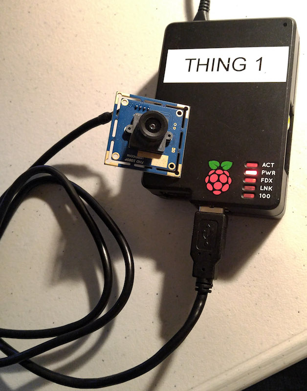
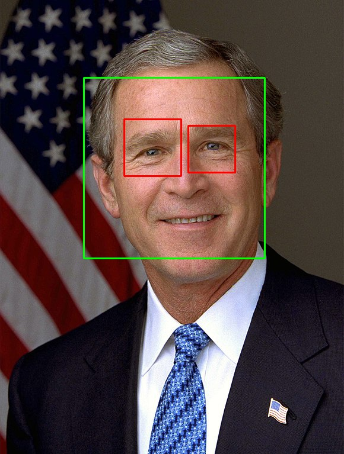

# OpenCV Face Detection

This repository contains utility scripts for doing facial detection in images using OpenCV.

Most of these scripts are experiments. The goal is to incorporate these scripts
into scripts for a Raspberry Pi facial detection device - see the [pi-opencv](https://github.com/charlesreid1-raspberry-pi/pi-opencv) 
repository.

## Repository Organization

Completed tasks:
* [Take a photo using a webcam](#takephoto)
* [Basic face-finding code](#basicfacial)
* [Consistent face-finding across multiple test photographs](#consistentfacial)
* [Consistent face-finding and eye-finding (over-sensitive)](#consistentfaceeyes)

In-progress tasks:
* Webcam face-finding script
* Find eyes in a photograph (using test images from internet)
* Find eyes in a webcam photograph (using webcam photos)
* Find a face that may be rotated up to N degrees (using webcam)
* Detect sideways faces using eyes angle

 
## Take a Photo Using Webcam

**STATUS: DONE**

`take_photo.py` - takes a photo with a webcam

* Imports OpenCV
* Captures an image from the specified camera device
* Transposes the image (rotate right)
* Saves the images to a file
* Uses imshow to show the images on screen
* (Future work) image is a numpy array, so do further processing/exports

 
## Basic Facial Recognition

**STATUS: DONE**

`basic_face_detection.py` - illustrate basic face detection

* Illustrates facial detection in the simplest script possible
* Cascade classifier is sensitive to parameter choices
* Does not generalize well

**Expected output:**

 
## Consistently Find a Face

**STATUS: DONE**

`find_face_image.py` - more generalized face detection script

* Open an image on disk using OpenCV or Pillow
* Create cascade classifier to find faces
* Get rectangles containing faces
* Draw rectangles around faces
* Get rectangles containing eyes
* Draw rectangles around eyes
* Show the image of the face with rectangles

This script worked on multiple face photos, including two
from the webcam that will be used with the final Raspberry Pi 
setup (one low-res, one high-res).

 
## Consistently Find Both Face and Eyes

**STATUS: DONE (OVER-SENSITIVE)**

`find_face_and_eyes_image.py` - generalized face + eyes detection script

Follows the same routine as `find_face_image.py`:

* Open an image on disk using OpenCV or Pillow
* Create cascade classifier to find faces
* Get rectangles containing faces
* Draw rectangles around faces
* Get rectangles containing eyes
* Draw rectangles around eyes
* Show the image of the face with rectangles

The problem is with eye detection, which is too sensitive to
the particular photograph and the parameters used.

Some tips:

* Easy to find eyes if face is well-lit and centered
* Dark/unlit faces make eyes (and face) difficult to detect
* If parameters too coarse, no or one eye detected
* If parameters too fine, mouth corners detected as eyes
* Sometimes a single eye is found twice, with significant overlap
* There are multiple eye detection classifiers, you should probably try them all
* Easiest scenario is to focus on *specific* camera, *specific* configuration, *specific* lighting conditions

## Find Face in Webcam Photograph

`webcam_face.py`

* Stream images from a webcam continuously
* Search for faces
* If faces are detected, output detected faces and bounding boxes to image
* Monitor output with a barebones web server

## Find Rotated Faces

Notes:
* https://stackoverflow.com/questions/5015124/rotated-face-detection#15997139

## Detect 

## Notes

Notes:
* It's easy to write a script that *usually* detects faces, or detects *one* eye, but 
    getting the task to work consistently, and always find a face and two eyes, is a pain.
* The process is extremely sensitive to the parameters used for the cascading classifier.
    Each different photo of a face requires different `scaleFactor` and `minNeighbors` settings
* Eyes are also difficult to detect without fiddling with settings that are specific to each image.
* [This](https://stackoverflow.com/questions/16128637/opencv-haarlike-eye-detection#16131846) SO question mentions an eye pair Haar cascade file.
* [opencv-contrib](https://github.com/opencv/opencv_contrib) repo has additional cascade .xml files
* See [opencv-contrib modules/face/data/cascades](https://github.com/opencv/opencv_contrib/tree/master/modules/face/data/cascades)

