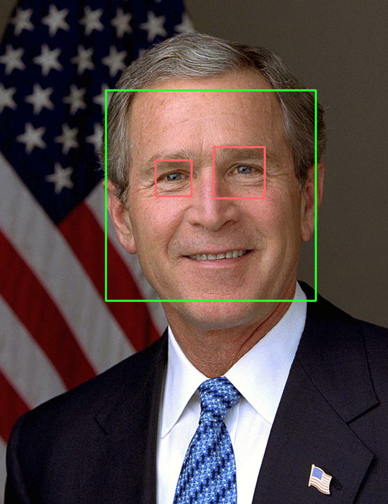

# OpenCV Face Detection

This repository contains utility scripts for doing facial detection in images using OpenCV.

Most of these scripts are experiments. The goal is to incorporate these scripts
into scripts for a Raspberry Pi facial detection device - see the [pi-opencv](https://github.com/charlesreid1-raspberry-pi/pi-opencv) 
repository.

## Repository Organization

Completed tasks:
* <s>Take a photo using a webcam</s>

In-progress tasks:
* Find a face in a photograph (using test images from internet)
* Find a face in a webcam photograph (using webcam photos)
* Find eyes in a photograph (using test images from internet)
* Find eyes in a webcam photograph (using webcam photos)
* Find a face that may be rotated up to N degrees (using webcam)
* Detect sideways faces using eyes angle

## Take a Photo Using Webcam

`take_photo.py`
* Imports OpenCV
* Captures an image from the specified camera device
* Transposes the image (rotate right)
* Saves the images to a file
* Uses imshow to show the images on screen
* (Future work) image is a numpy array, so do further processing/exports

## Find a Face

`find_face_image.py`
* Opens an image on disk using OpenCV or Pillow
* Create cascade classifier to find faces
* Get rectangles containing faces
* Draw rectangles around faces
* Get rectangles containing eyes
* Draw rectangles around eyes
* Show the image of the face with rectangles

Notes:
* It's easy to accomplish 90% of the task, but it's a pain in the ass to get it working consistently.
* Each different photo of a face requires different `scaleFactor` and `minNeighbors` settings
* Eyes are also difficult to detect without fiddling with settings that are specific to each image.
* [This](https://stackoverflow.com/questions/16128637/opencv-haarlike-eye-detection#16131846) SO question mentions an eye pair Haar cascade file.
* [opencv-contrib](https://github.com/opencv/opencv_contrib) repo has additional cascade .xml files
* See [opencv-contrib modules/face/data/cascades](https://github.com/opencv/opencv_contrib/tree/master/modules/face/data/cascades)

## Find Face in Webcam Photograph

## Find Rotated Face

## Detect 

## Find a Face

`find_face_image.py` - find a face in an image.

Expected output:

Link to [OpenCV documentation](https://docs.opencv.org/master/d7/d8b/tutorial_py_face_detection.html)
